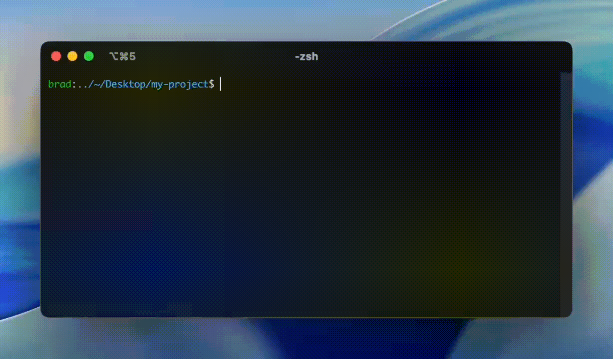

<h1 align="center">ccyolo</h1>

<p align="center">
Run Claude Code in Docker with auto-accept enabled. <i>Same CLI, no setup, full YOLO.</i>
</p>

<p align="center">

</p>

## Install

```bash
npm install -g @ccdevkit/ccyolo
```

## Usage

Use it exactly like `claude`:

```bash
ccyolo                    # Interactive mode
ccyolo -p "hello"         # One-shot prompt
ccyolo -c                 # Continue previous session
ccyolo -r                 # Resume session picker
```

All `claude` flags work as expected.

## Why

- Works out of the box - no container setup required
- Full CLI parity with `claude`
- Runs with auto-accept enabled (YOLO mode)
- Your working directory is mounted into the container
- Your Claude credentials are passed through automatically

## ccyolo flags

ccyolo flags go before `--`, claude flags go after:

```bash
ccyolo -v -- -p "hello"              # Verbose mode
ccyolo --log /tmp/debug.log -- -c    # Log to file
ccyolo --pt git -- -p "git status"   # Run git on host instead of container
```

| Flag | Description |
|------|-------------|
| `-v`, `--verbose` | Enable debug logging to stderr |
| `--log <path>` | Write debug logs to file |
| `--pt <cmd>`, `--passthrough <cmd>` | Run commands matching prefix on host (repeatable) |

### Passthrough

By default, all commands run inside the container. This is usually fine, but some commands need to run on your host machine - things like `docker`, `gh`, or commands that need access to host resources.

Use `--pt` to specify command prefixes that should run on the host:

```bash
ccyolo --pt git --pt docker -- -p "build and push the image"
```

This runs `git` and `docker` commands on your host, while everything else runs in the container. You can specify `--pt` multiple times.

## Requirements

- Docker
- `claude` must be authenticated on your machine
